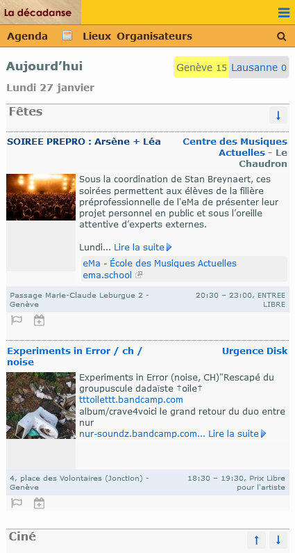

# La décadanse
📅 Agenda culturel local

> [!WARNING]
> En raison d'une grande partie de code legacy, et pour des raisons de sécurité, ne déployez pas cette application sur des serveurs publics. La [modernisation est en cours](https://github.com/users/agilare/projects/2/views/1), vous pouvez [contribuer](README.md#contribuer)

La décadanse est un site web qui présente aux visiteurs une sélection d'événements culturels locaux et accessibles. Il est actuellement [déployé pour Genève et Lausanne](https://www.ladecadanse.ch/)



Les organisateurs d'événements ont la possibilité de s'inscrire puis de se présenter et annoncer leurs événements.

Les principales sections du site sont :
- un **agenda d'événements**, chacun de ceux-ci ayant sa fiche détaillée accompagnée de quelques services (signaler une erreur, format iCal...)
- un répertoire des **Lieux** où se déroulent des événements, avec détails, présentation, photos
- un répertoire des **Organisateurs d'événements**, similaire aux Lieux
- un **back-office** permettant de gérer les diverses entités du site : utilisateurs, événements, lieux, organisateurs, etc.

## Installation locale

Ces instructions vous permettront de mettre en place une copie du projet sur votre machine locale à des fins de développement et de test. Voir [déploiement](README.md#déploiement) pour des notes sur la façon de déployer le projet sur un système actif.

### Prérequis
- Apache 2.4
- PHP 8.0 (avec les extensions `fileinfo`, `mysqli`, `mbstring`, `gd`)
- Composer
- MariaDB 10.6/MySQL 5.7 (with `sql_mode` containing `ALLOW_INVALID_DATES`)

### Manuelle
1. cloner la branche `master`
1. `composer install`
1. base de données
    1. créer une base de données avec `COLLATE 'utf8mb4_unicode_ci'` par ex.
        ```mysql
        CREATE DATABASE `ladecadanse` /*!40100 COLLATE 'utf8mb4_unicode_ci' */;
        ```
    1. créer un utilisateur avec les droits suffisants sur cette base de données, par ex.
        ```mysql
        CREATE USER 'ladecadanse'@'localhost' IDENTIFIED BY 'my-password';
        GRANT USAGE ON *.* TO 'ladecadanse'@'localhost';
        GRANT SELECT, INSERT, DELETE, UPDATE  ON `ladecadanse`.* TO 'ladecadanse'@'localhost';
        ```
    1. importer dans la base de données `resources/ladecadanse.sql` (la structure, et les données utiles pour la table `localite`)
    1. ajouter un 1er utilisateur, l'*admin* (groupe 1) qui vous servira à gérer le site (mot de passe : `admin_dev`) :
        ```mysql
        INSERT INTO `personne` (`idPersonne`, `pseudo`, `mot_de_passe`, `cookie`, `groupe`, `statut`, `affiliation`, `region`, `email`,  `signature`, `avec_affiliation`, `gds`, `actif`, `dateAjout`, `date_derniere_modif`) VALUES (NULL, 'admin', '$2y$10$34Z0QxaycAgPFQGtiVzPbeoZFN1kwLEdWDEBI1kEOJGK4A3xRJtMa', '', '1', 'actif', '', 'ge', '', 'pseudo', 'non', '', '1', '0000-00-00 00:00:00.000000', '0000-00-00 00:00:00.000000');
        ```
1. `cp app/env_model.php app/env.php` et y saisir les valeurs de votre environnement (davantage d'explications et exemples se trouvent dans le fichier lui même), avec au minimum les informations de connexion à la base de données
1. `cp .htaccess.example .htaccess` si vous voulez implémenter une configuration PHP et Apache de base pour le développement en local

### Par Docker
Lancer la commande suivante à la racine du projet :
```sh
docker compose up -d
```
Le site ladecadanse est déployé sur localhost:7777. Le mot de passe, par défaut, pour l'utilisateur `admin` est `admin_dev`.

### Usage
Une fois le site fonctionnel, se connecter avec le login *admin* (créé ci-dessus) permet d'ajouter et modifier des événements, lieux, etc. (partie publique) et de les gérer largement (partie back-office)

## Tests

See [tests/README.md](tests/README.md)

## Déploiement

### Prérequis
Un espace sur un serveur avec l'infrastructure prérequise, une timezone définie et une base de données

### Avec Git-ftp

#### Prérequis
1. installer [git-ftp](https://github.com/git-ftp/git-ftp/blob/master/INSTALL.md)
1. dans le répertoire du projet, configurer les données de connexion (ici avec un scope pour le site de production : `prod`) :
    ```sh
    $ git config git-ftp.prod.user mon-login
    $ git config git-ftp.prod.url "ftp://le-serveur.ch/web"
    $ git config git-ftp.prod.password 'le-mot-de-passe'
    ```

#### Pour mettre en place
1. premier envoi des fichiers
    ```sh
    $ git ftp init -s prod
    ```
1. dans `app/env.php` [configurer le site  selon l'environnement](README.md#manuelle)

#### Pour mettre à jour avec les derniers commits
```sh
$ git ftp push -s prod
```

## Analyse du code

Cinq analyseurs de code PHP sont disponibles et peuvent être exécutés via Composer.

- ils sont configurés pour la version de PHP [requise](#Prerequis)
- le niveau d'analyse est réglé aussi haut que possible, mais pas trop pour ne pas relever les erreurs dûes à l'ancienneté du code (par ailleurs certaines erreurs peu ou pas pertinentes sont ignorées) et ciblé plutôt pour la version de PHP requise
- les répertoires vendor, var, etc. sont ignorés

### phpstan

```sh
$ composer phpstan
```

Erreurs nombreuses et peu importantes ignorées stockées dans `phpstan-baseline.neon`

### Rector

Sans modification directe du code :
```sh
$ composer rector:dry-run
```

### Psalm

```sh
$ composer psalm
```

### Phan

```sh
./vendor/bin/phan --progress-bar -o phan80.txt
```

puis éventuellement, pour abréger le rapport :

```sh
cat phan80.txt | cut -d ' ' -f2 | sort | uniq -c | sort -n -r
```

### PHPCompatibility

Dispo de PHP 8.0 à 8.2

```sh
$ composer sniffer:php80
```

## Changelog
Voir le [changelog](CHANGELOG.md) et les [releases sur GitHub](https://github.com/agilare/ladecadanse/releases)

## Contribuer

Le projet accepte volontiers de l'aide ; il y a diverses manières de contribuer comme améliorer la sécurité et la qualité du site, tester des fonctionnalités, etc.
Les [lignes directrices pour les contributions](CONTRIBUTING.md) décrivent en détail l'état actuel du projet, les possibilités d'aide et comment le faire.

## Contact
Michel Gaudry - michel@ladecadanse.ch

[GitHub La décadanse](https://github.com/agilare/ladecadanse)

## Licence
This work is licensed under AGPL-3.0-or-later
